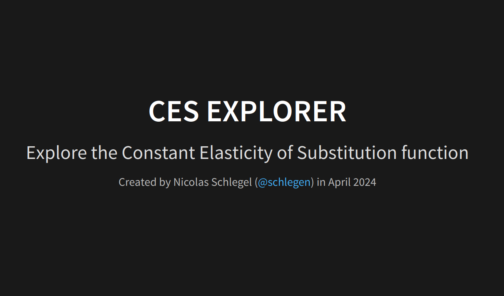
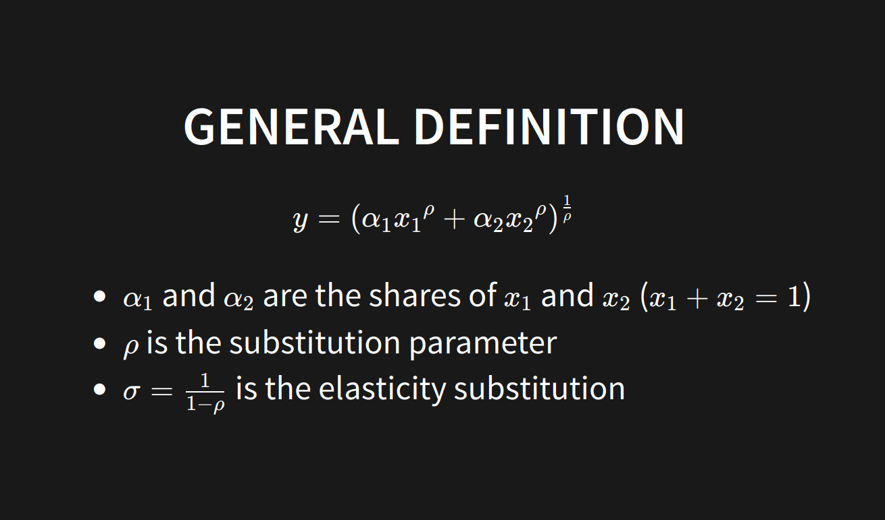
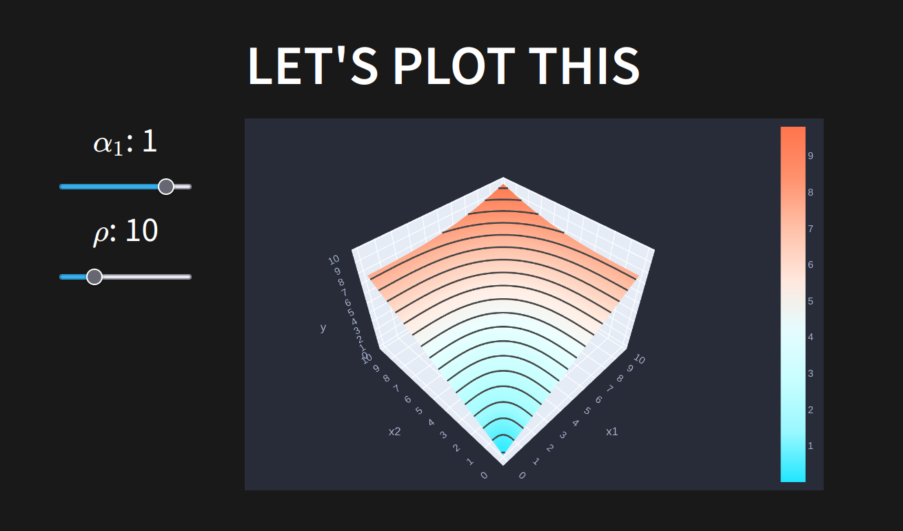
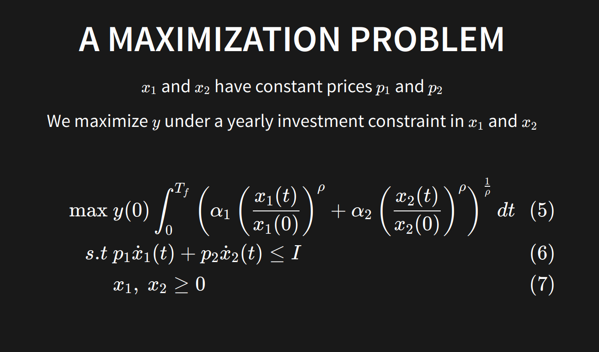
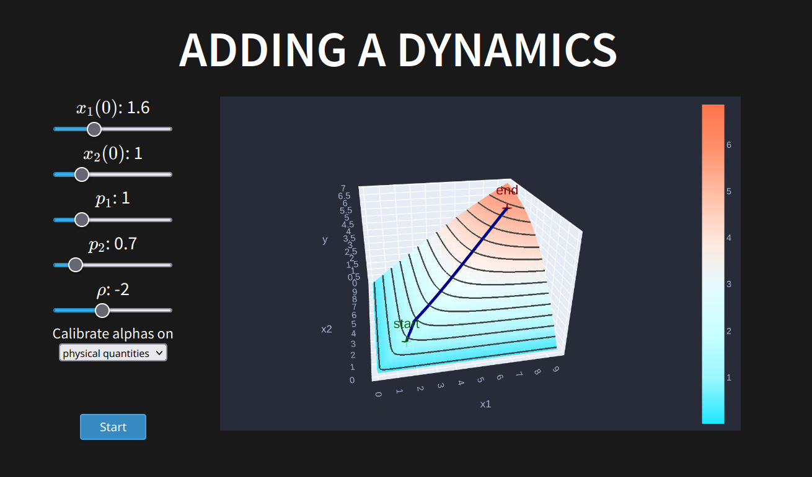
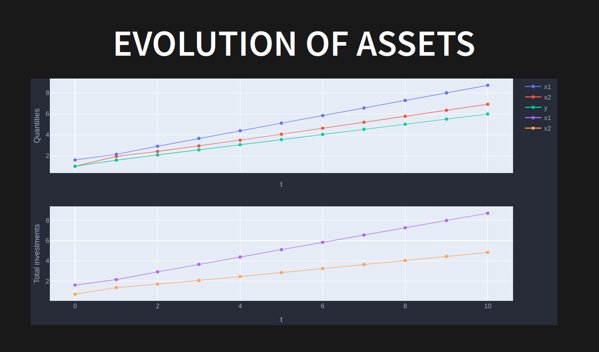

# CES explorer

## Presentation

Web app presenting some insights about the constant elasticity of substitution function.

```math
y = (\alpha_1 {x_1}^{\rho} + \alpha_2 {x_2}^{\rho}) ^{\frac{1}{\rho}}
```

We first propose some plots of the function with intercative sliders.
In a second part, we design and solve an optimal control problem consisting in maximizing a CES under a constraint on total investments.

```math
\begin{align}
\max ~&\int_0^{T_f} y(t) dt\\
    s.t ~ & \frac{y(t)}{y(0)} = \left(\alpha_1 \left({\frac{x_1(t)}{x_1(0)}}\right)^{\rho} + \alpha_2
    \left({\frac{x_2(t)}{x_2(0)}}\right)^{\rho} \right) ^{\frac{1}{\rho}}\\
    & p_1 \dot{x}_1(t) + p_2 \dot{x}_2(t) = I\\
    & x_1,~x_2 \geq 0
\end{align}
```

This app is codes in Python (Flask), HTML, CSS and javascript. I used the Javascript framework Reveal.jsm that allows to design presentations with web languages.

## Content preview

  
  

## Running the app

pip install the reauireements.txt then type the follozing line on your terminal

```{bash}
cd src
python flask_app.py
```

